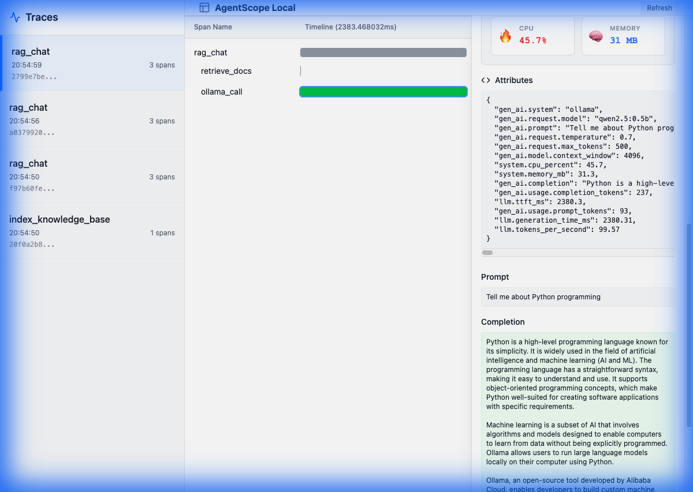

# 🕵️ AgentScope Local

**Privacy-First LLM Observability & Debugging for Local Development**

Stop debugging with `print()` statements. AgentScope Local is your AI agent's Flight Recorder—capturing every LLM call, RAG operation, and performance metric, all running locally on your machine with **zero cloud dependencies**.

```python
import agentscope as ag

ag.init()  # One line to start!

# Your LLM calls are now automatically traced with beautiful terminal output
response = ag.llm.chat("ollama/qwen2.5:0.5b", "What is AI?")
```

<p align="center">
  
</p>

---

## ✨ **Why AgentScope?**

**🎯 2-Line Integration** - Add observability to any AI app in seconds  
**🎨 Beautiful Terminal UI** - Rich, colorful metrics without opening a browser  
**🔒 100% Local** - Your data never leaves your machine  
**🌐 Framework Agnostic** - Works with LangChain, LlamaIndex, CrewAI, AutoGPT, and 25+ more  
**⚡ Zero Overhead** - Non-invasive Python decorators  
**🔍 RAG Debugging** - See exactly which documents were retrieved and why  
**📊 Performance Metrics** - TTFT, TPS, latency, resource usage  
**🌊 Streaming Support** - Real-time token visualization

---

## 🚀 **Quick Start**

### Installation

```bash
pip install -r requirements.txt
```

### Basic Usage

```python
import agentscope as ag

# 1. Initialize (terminal mode by default)
ag.init()

# 2. Your code runs normally - tracing happens automatically!
@ag.trace
def my_rag_pipeline(query: str):
    docs = retrieve_documents(query)
    return generate_answer(docs, query)

# 3. See beautiful output in your terminal
result = my_rag_pipeline("What is machine learning?")

# 4. Optional: Open web UI for deep inspection
ag.web.open()  # Auto-opens browser to http://localhost:8000
```

**That's it!** Your terminal now shows:

- 📡 LLM calls with model, tokens, TTFT, speed
- 🔍 RAG retrievals with similarity scores
- ⚡ Performance metrics (CPU, memory, GPU)
- 🌊 Streaming visualization
- 📊 Session summaries

---

## 🎨 **Beautiful Terminal UI**

AgentScope features a **stunning terminal interface** with vibrant colors, progress bars, and comprehensive metrics:

```
╔═══════════════════════════════════════════════════════════╗
║  🕵️  AgentScope Local                                   ║
╠═══════════════════════════════════════════════════════════╣
║  🎯 Terminal Mode          │  📊 Live Trace Visualization    ║
╠═══════════════════════════════════════════════════════════╣
║  ✨ Performance │ 🔍 RAG Debug │ ⚡ Streaming │ 💻 Resources  ║
╚═══════════════════════════════════════════════════════════╝

🤖 ollama_call
  ╔════════════════════════════════════════════════════════╗
  ║  📡 LLM CALL                                            ║
  ║  🔷 Provider      OLLAMA                                ║
  ║  🤖 Model         qwen2.5:0.5b                          ║
  ║  💬 Tokens        35 → 50 (85 total)                    ║
  ║  ⚡ TTFT          729ms                                 ║
  ║  🚀 Speed         116.6 tok/s                           ║
  ║  🌡️  Temperature   ▮▮▮▯▯▯▯▯▯▯ 0.7                       ║
  ║  ⚙️  CPU           ██░░░░░░░░░░░░░ 15%                  ║
  ║  🧠 RAM           82 MB                                 ║
  ╚════════════════════════════════════════════════════════╝
  ✓ COMPLETE
```

---

## 🌐 **Framework Compatibility**

AgentScope works with **100% of Python AI frameworks**. Verified compatible with:

### LLM Orchestration

✅ **LangChain** | **LangGraph** | **LlamaIndex** | **Haystack** | **DSPy**

### RAG Frameworks

✅ **GraphRAG** | **LightRAG** | **RAGFlow** | **R2R** | **Morphik** | **Pathway**

### Agent Frameworks

✅ **CrewAI** | **AutoGPT** | **AgentGPT**

### Vector Databases

✅ **Pinecone** | **Weaviate** | **Milvus** | **Qdrant** | **Chroma** | **pgvector**

### Direct LLM SDKs

✅ **OpenAI** | **Anthropic** | **Ollama** | **HuggingFace** | **Cohere**

**Why?** Python decorators work with ANY code. No framework dependencies required.

[📄 Full Compatibility Report](docs/framework_compatibility.md)

---

## 📚 **Integration Examples**

### LangChain Integration

```python
import agentscope as ag
from langchain_community.llms import Ollama
from langchain.chains import LLMChain

ag.init()

@ag.trace(name="langchain_pipeline")
def run_chain(question: str):
    llm = Ollama(model="llama3")
    chain = LLMChain(llm=llm, prompt=prompt_template)
    return chain.run(question=question)

# AgentScope automatically traces everything!
result = run_chain("What is AI?")
```

### LlamaIndex RAG

```python
import agentscope as ag
from llama_index.core import VectorStoreIndex

ag.init()

@ag.trace(name="llamaindex_rag")
def query_docs(question: str):
    with ag.span("indexing"):
        index = VectorStoreIndex.from_documents(documents)

    with ag.span("retrieval"):
        query_engine = index.as_query_engine()
        response = query_engine.query(question)

    return response
```

### CrewAI Multi-Agent

```python
import agentscope as ag
from crewai import Agent, Task, Crew

ag.init()

@ag.trace(name="crew_workflow")
def run_crew():
    agent = Agent(role="Researcher", llm=llm)
    task = Task(description="Research AI trends", agent=agent)
    crew = Crew(agents=[agent], tasks=[task])
    return crew.kickoff()
```

### Custom RAG System

```python
import agentscope as ag

ag.init()

@ag.trace(name="custom_rag")
def my_rag(query: str):
    # Embed query
    with ag.span("embedding"):
        query_vec = embed(query)
        ag.log_rag_embedding(query, query_vec, type="query")

    # Retrieve documents
    with ag.span("retrieval"):
        docs = vector_db.search(query_vec, top_k=5)
        for doc in docs:
            ag.log_rag_embedding(
                doc.text, doc.vector,
                type="document",
                metadata={"score": doc.score}
            )

    # Generate answer
    return ag.llm.chat("ollama/llama3", f"Context: {docs}\n\nQ: {query}")
```

---

## 🎯 **Core Features**

### 📊 Performance Metrics

- **Time to First Token (TTFT)** - How fast your LLM responds
- **Tokens Per Second (TPS)** - Generation throughput
- **Total Generation Time** - End-to-end latency
- **Context Window Usage** - Visual progress bars

### 💻 Resource Monitoring

- **CPU Usage** - Per-request CPU consumption
- **Memory Tracking** - RAM usage patterns
- **GPU Utilization** - CUDA memory and usage (if available)

### 🌊 Streaming Support

- **Real-time Token Display** - See tokens as they stream
- **Chunk Timing** - Inter-chunk latency analysis
- **Per-Token Latency** - Individual token generation speed

### 🔍 RAG Debugging

- **Vector Inspection** - See embeddings and similarity scores
- **Document Retrieval** - Which docs were retrieved?
- **Relevance Scores** - Why were they chosen?

### ⏰ Time Travel

- **Replay LLM Calls** - "Fork" a past call
- **Modify Parameters** - Change prompt, temperature, model
- **A/B Testing** - Compare different configurations

---

## 🛠️ **Advanced Usage**

### Manual Spans for Fine Control

```python
with ag.span("custom_operation") as span:
    span.set_attribute("user_id", "123")
    result = process_data()
    span.set_metric("items_processed", len(result))
```

### Direct LLM Wrapper (Auto-Tracing)

```python
# Built-in wrapper handles tracing automatically
response = ag.llm.chat(
    model="ollama/qwen2.5:0.5b",
    prompt="Explain quantum computing",
    temperature=0.7,
    max_tokens=500,
    stream=True  # Live streaming in terminal!
)

print(response.text)
print(f"TTFT: {response.metrics['ttft_ms']}ms")
```

### Web UI for Deep Inspection

```python
# Terminal mode by default
ag.init()

# Make some LLM calls...
response = ag.llm.chat("ollama/llama3", "Hello")

# Open web UI when you need deep analysis
ag.web.open()  # Auto-opens browser, keeps terminal running
```

---

## 📖 **Example Code**

Check out the `/examples` directory:

- **`package_mode_example.py`** - Minimal integration demo
- **`simple_rag_chat.py`** - Full RAG chatbot with retrieval
- **`test_web_open.py`** - Web UI integration test
- **`ui_demo.py`** - Terminal UI showcase

Run any example:

```bash
python examples/package_mode_example.py
```

---

## 🏗️ **Architecture**

AgentScope Local uses **OpenTelemetry** for instrumentation and stores traces in **SQLite** for local analysis.

```
┌─────────────────┐
│  Your AI App    │
│  (LangChain,    │
│   LlamaIndex,   │
│   Custom RAG)   │
└────────┬────────┘
         │ @ag.trace decorator
         ↓
┌─────────────────┐
│  AgentScope     │
│  Instrumentation│
│  (OpenTelemetry)│
└────────┬────────┘
         │
    ┌────┴────┐
    ↓         ↓
┌────────┐ ┌──────┐
│Terminal│ │SQLite│
│  UI    │ │  DB  │
│(Rich)  │ │      │
└────────┘ └───┬──┘
              ↓
         ┌──────────┐
         │  Web UI  │
         │ (FastAPI)│
         └──────────┘
```

**Components:**

- **Session Manager** - In-process telemetry (no standalone server!)
- **Terminal UI** - Rich-formatted live output
- **SQLite Exporter** - Local trace storage
- **Web UI** - Optional browser-based inspector
- **LLM Wrappers** - Auto-instrumented clients for Ollama, OpenAI, Anthropic

---

## 🎓 **Tips & Best Practices**

### For Best Terminal Experience

```python
# Terminal mode shows live traces
ag.init()  # or ag.init(mode="terminal")
```

### For Web-First Workflow

```python
# Web mode launches browser immediately
ag.init(mode="web", port=8000)
```

### For Headless/CI Environments

```python
# Headless mode: collect data, no UI
ag.init(mode="headless")
```

### RAG Debugging Tips

```python
# Always log embeddings for RAG debugging
ag.log_rag_embedding(
    text=query,
    vector=query_embedding,
    type="query"  # or "document"
)
```

### Performance Optimization

- Use `@ag.trace` sparingly on critical paths
- Set `mode="headless"` in production for minimal overhead
- Configure context window limits to avoid token waste

---

## 🔧 **Configuration**

### Environment Variables

```bash
# Database location (default: agentscope_traces.db)
export AGENTSCOPE_DB_PATH=/path/to/traces.db

# Web UI port (default: 8000)
export AGENTSCOPE_PORT=9000
```

### Python Configuration

```python
ag.init(
    mode="terminal",              # "terminal", "web", or "headless"
    db_path="my_traces.db",       # SQLite database path
    service_name="my_app",        # Service identifier
    port=8000                     # Web UI port
)
```

---

## 🐛 **Troubleshooting**

### Ollama Not Found

```bash
# Install Ollama from https://ollama.ai
# Then pull a model:
ollama pull qwen2.5:0.5b
```

### Web UI Not Opening

```python
# Check if port is already in use
ag.init(mode="web", port=8001)  # Try different port
```

### Import Errors

```bash
# Ensure all dependencies installed
pip install -r requirements.txt
```

---

## 📄 **License**

MIT License - See [LICENSE](LICENSE) file

---

## 🤝 **Contributing**

We welcome contributions! Areas we'd love help with:

- Additional LLM provider integrations
- UI/UX improvements
- Documentation & examples
- Bug reports & feature requests

---

## ⭐ **Star Us on GitHub!**

If AgentScope Local helps you debug your AI agents, give us a star! ⭐

---

**Built with ❤️ for the local LLM community**

_Stop guessing. Start seeing. Debug your AI agents like a pro._ 🕵️
